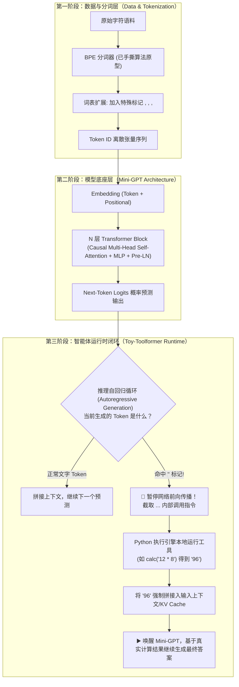

# 从零手撕 Mini-GPT 到 Tool-Use 智能体闭环（Toy-Toolformer）
## —— 本科生学术进阶与读研（保研/考研）核心项目全栈规划

> **项目代号**：`Mini-GPT-Agent-From-Scratch`  
> **项目定位**：打通从“底层张量计算与自注意力机制”到“端到端智能体工具调用闭环”的硬核研究型项目。  
> **核心宗旨**：拒绝做只会调用闭源 API（OpenAI / DeepSeek）的浅层 Prompt 搬运工，通过手撕全流程彻底搞懂大模型内部机理与 Agent 运行时架构。

---

## 一、 项目终极愿景与系统架构蓝图

传统大模型只是文本输入到文本输出的**被动概率计算器**，而智能体（Agent）赋予了模型**使用外部工具、感知环境反馈的主动能力**。

本项目旨在实现一个由你纯手工搭建的微型 Decoder-only Transformer（Mini-GPT），并在此基础上借鉴 Meta 顶会经典论文 **《Toolformer》** 的思想，实现模型自主判断并调用 Python 本地计算工具（如计算器、数据库查询）的完整闭环。

### 1. 全链路系统架构图（Mermaid）



---

## 二、 现状盘点：我们已有基础 vs 亟待补齐的知识清单

### 1. 目前已具备的基础（你的优势）
* [x] **NLP 核心分词算法底层功底**：已完整掌握并手撕了 `BPE Tokenizer` 的加权频次统计、滑动窗口、双指针状态机跳步替换逻辑。
* [x] **算法思维与严密代码习惯**：对边界保护、短路求值、平局决胜（Tie-breaking）等底层细节有深入理解。
* [x] **学习方法正确**：坚持从底层推导原理，而不是盲目调包。

---

### 2. 目前需要补齐的知识清单（按推进优先级排序）

#### 模块一：PyTorch 核心张量运算与面向对象骨架（预计耗时：3~5 天）
* [ ] **`torch.Tensor` 高维切片与广播机制（Broadcasting）**：搞懂 3D/4D 张量 `(Batch, Seq_Len, Hidden_Dim)` 的各种变形（`view()`, `transpose()`, `contiguous()`）。
* [ ] **`torch.nn.Module` 生命周期**：
  * `__init__()` 中定义可学习参数层（权重、偏置）。
  * `forward()` 中定义张量的前向流动逻辑。
* [ ] **深度学习基础三件套**：
  * 优化器：`torch.optim.AdamW`
  * 损失函数：`torch.nn.CrossEntropyLoss`（理解语言模型的自回归 CrossEntropy 计算）
  * 反向传播与梯度裁剪：`loss.backward()` 与 `torch.nn.utils.clip_grad_norm_`

#### 模块二：Decoder-only Transformer 核心算子手撕（预计耗时：1 周）
* [ ] **Token Embedding 与 Positional Encoding（位置编码）**：
  * 理解为什么 Transformer 本身不具备时序感知，必须显式加上位置向量。
* [ ] **自注意力机制（Scaled Dot-Product Attention）**：
  * 公式：$\text{Attention}(Q, K, V) = \text{softmax}\left(\frac{QK^T}{\sqrt{d_k}} + M\right)V$
  * **因果掩码（Causal Mask / Look-ahead Mask）**：深度理解为什么解码器只能看左边，上三角必须用 $-\infty$ 遮蔽。
* [ ] **多头自注意力（Multi-Head Attention, MHA）**：
  * 多头拆分与并行矩阵相乘的张量维度演变过程。
* [ ] **前馈神经网络（FFN / MLP）**：升维与降维投影（通常扩大 4 倍隐藏维度）。
* [ ] **Pre-Layer Normalization 与残差连接（Residual Connections）**：保证深层网络梯度平稳流动。

#### 模块三：自回归生成引擎（Autoregressive Inference）（预计耗时：3~4 天）
* [ ] **单步推进生成循环**：
  * 接收一段 Prompt，前向传播预测出最后一个位置的 Logits。
  * **采样策略**：贪心（Greedy Search）、Temperature 控制、Top-k 采样。
  * 将新生成的 Token 拼回原序列，进入下一轮迭代。
* [ ] **停止条件与拦截机制**：
  * 遇到 `<EOS>` 停止生成；
  * **遇到 `</tool>` 触发钩子函数（Hook / Interceptor），暂停生成**。

#### 模块四：合成数据构造与微调（SFT / In-Context Tool Use）（预计耗时：3~5 天）
* [ ] **构造玩具工具调用数据集**：
  * 用 Python 脚本自动化生成 1000~2000 条问答与计算样本。
  * 格式示例：`"请问 15 乘以 4 等于几？答：<tool>calc(15*4)</tool><res>60</res> 等于 60。"`
* [ ] **Masked Loss 训练技巧**：
  * 理解为什么提问部分不需要算 Loss，只对模型需要生成回答与 `<tool>` 的部分回传梯度。

#### 模块五：外部环境执行引擎（Agent Runtime）（预计耗时：2 天）
* [ ] **正则解析器**：从模型吐出的 `<tool>calc(15*4)</tool>` 中抽取出函数名 `calc` 和入参 `15*4`。
* [ ] **安全执行沙箱**：定义可调用的本地 Python 函数（计算器、单位换算或简单的键值对数据库查询）。
* [ ] **上下文回填与二次唤醒**：组装 `<res>60</res>` 并无缝拼接回上下文，让模型继续吐字。

---

## 三、 分阶段实施路线图（Milestone Roadmap）

```
[阶段 1: 分词闭环] (100% 原型已就绪)
  └── 封装现有 BPE 代码，导出带特殊 Token (<tool>, </tool>, <res>, </res>) 的 Vocab
       │
       ▼
[阶段 2: Mini-GPT 骨架搭建]
  └── 纯 PyTorch 实现 Causal Self-Attention, Multi-Head, Pre-LN, TransformerBlock
  └── 拼接成约 200~300 行的简洁 mini-gpt 模型类
       │
       ▼
[阶段 3: 极小数据收敛验证]
  └── 在微型文本库（如莎士比亚戏剧选段）上训练，验证 Loss 顺利下降，能吐出连贯英文句子
       │
       ▼
[阶段 4: 注入 Agent 能力（数据微调）]
  └── 注入 1000 条合成算术/查表样本，微调 Mini-GPT，使其形成输出 <tool> 的概率倾向
       │
       ▼
[阶段 5: 打造 Toy-Toolformer 拦截运行时]
  └── 改造 generate 循环，实现拦截、外部 Python 执行、结果回填与唤醒生成的端到端系统！
```

---

## 四、 面试/读研述职杀手锏（如何向导师讲这个项目？）

当考研复试、保研夏令营或导师组会让你介绍做过的深度学习/NLP 项目时，请使用以下结构化述职策略：

### 1. 一分钟高含金量陈述模板
> “老师好，在本科阶段，我没有简单地使用 LangChain 等高级框架调包做界面，而是选择**自底向上探究大模型与智能体的底层架构**。  
> 1. **分词层**：我从零用 Python 手撕实现了 **BPE（字节对编码）分词算法**，攻克了词频加权统计、确定性平局决胜与双指针动态跳步替换等底层细节；  
> 2. **模型层**：基于 PyTorch 独立搭建了 **Decoder-only 架构的 Mini-GPT**，完整实现了因果多头自注意力、掩码机制与残差连接；  
> 3. **智能体层**：借鉴 Meta **Toolformer** 论文的开创性思路，我定义了工具调用协议标记，修改了自回归解码循环，设计了一套**推理拦截与上下文动态注入机制**，使得这个微型模型能够自主判断并调用本地计算引擎，完成了闭环智能体系统的全栈实现。”

### 2. 导师可能考察的高频深度追问与标准应答

* **Q1：为什么不在模型内部直接通过扩大参数来算数学，而一定要让它调工具？**
  * **回答要点**：大模型本质是基于词频统计概率的“联想生成器”，它在做非确定性语义理解时极强，但做确定性符号计算（如大数乘除、高精度微积分）天然缺乏严密性（容易出现注意力漂移与幻觉）。让模型负责**“意图理解与规划（Planning）”**，把计算外包给**“确定性算法/外部工具（Tools）”**，是兼顾智能与可靠性的最优范式。
* **Q2：推理拦截时，外部计算结果回填后，模型的 KV Cache（键值缓存）如何处理？**
  * **回答要点**：在标准自回归生成中，由于历史 Token 不变，可以保留前面的 KV Cache。当外部工具返回 `<res>xxx</res>` 时，把这串新 Token 当作由外部环境强制提供的输入（Prompt Injection），将其追加送入网络计算得到对应的 Keys 和 Values 存入 Cache，随后继续向后生成。这展示了你对现代推理加速机制的深刻理解。

---

## 五、 推荐参考基准与经典论文

1. **基石论文**：
   * Vaswani et al. 《Attention Is All You Need》 (Transformer 架构圣经)
   * Schick et al. 《Toolformer: Language Models Can Teach Themselves to Use Tools》 (NeurIPS 2023，本项目理论来源)
   * Yao et al. 《ReAct: Synergizing Reasoning and Acting in Language Models》 (ICLR 2023)
2. **标杆开源代码库**：
   * Andrej Karpathy: `nanoGPT` / `minGPT`（最优雅纯粹的 PyTorch Transformer 实现模板）
   * HuggingFace: `transformers` 官方生成源码（重点看 `generate()` 内部停止词处理逻辑）
