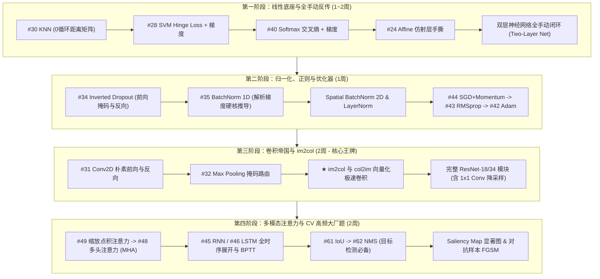

# CS231n 全通关手撕路线图与 Deep-ML 题单全景对照指南

> **核心愿景**：  
> 彻底征服斯坦福大学计算机视觉殿堂级课程 **CS231n（Convolutional Neural Networks for Visual Recognition）**。  
> 拒绝浮于表面的调包（`import torch.nn as nn`），回归计算图与多元微积分底层，建立**“纯手工推导并手撕每一层前向传播（Forward）与反向传播（Backward）”**的硬核算法内功。

---

## 一、 为什么 CS231n 是检验底层手撕实力的“黄金标准”？

在深度学习领域，很多初学者以为掌握模型就是调库拼搭层。但顶尖高校（如斯坦福、清华）和一线大厂核心算法团队评判一个候选人的深度学习底蕴，看的是能否：
1. **脱离自动求导（Autograd）写反向传播**：给你一个全连接层、ReLU、Softmax 或 BatchNorm，手写出矩阵维度的解析梯度公式。
2. **实现零循环向量化（Zero-Loop Vectorization）**：拒绝任何 Python 原生 `for` 循环，用矩阵广播（Broadcasting）和点积把距离计算、损失计算加速百倍。
3. **手写高效卷积底座（im2col / col2im）**：理解现代 GPU 卷积如何通过特征展开转化为矩阵乘法（GEMM）。

本指南将 **CS231n 的三大作业（Assignment 1, 2, 3）体系** 与 **Deep-ML 题单** 进行地毯式映射，全面诊断你当前的完成进度，并列出实现“完全胜任 CS231n”所需的全部手撕拼图。

---

## 二、 现状诊断与手撕差距分析（Gap Analysis）

### 1. 当前已完成模块（Done）
* ✅ **语言模型推理与解码**：`Top-k采样.py`、`Top-p采样.py`、`温度采样.py` (2073)、`温度Top-k与Top-p过滤.py` (3225)、`束搜索解码.py`
* ✅ **统计学习与序列标注**：`HMM前向算法.py`、`HMM维特比算法.py`、`CRF维特比算法.py`
* ✅ **损失函数基础**：`数值稳定的softmax.py` (23)、`KL散度.py` (57)
* ✅ **基础结构**：
  * `残差块简单版.py` (2106, 线性基础版)
  * `手撕LSTM.py` (2111, 单步 LSTMCell 前向与参数绑定)

### 2. 核心差距定位（The Critical Gaps）
你目前的代码在“生成式解码策略”和“序列模型”上有非常好的开头，**但面对 CS231n 的核心考核点，目前仍有 4 大关键底座处于完全真空或待深化状态**：
1. **缺少“纯手动反向传播（Backpropagation from Scratch）”链条**：目前大部分代码侧重前向推断，缺少从损失函数倒推各层参数梯度的 `backward` 闭环。
2. **缺少“卷积与池化（CNN Foundations）”底层**：CS231n 的灵魂是卷积。2D 卷积、最大池化、以及大厂高频面试题 `im2col` 尚未实现。
3. **缺少“归一化与优化器（Norm & Optimizers）”引擎**：训练现代深度网络的核心构件——BatchNorm（尤其是反向解析导数）、LayerNorm、SGD+Momentum、Adam 尚未覆盖。
4. **缺少“高阶计算机视觉算子”**：目标检测与可解释性算子（IoU、NMS、Saliency Map）尚未补齐。

---

## 三、 CS231n 三大作业与 Deep-ML 题单全景对照表

以下按照 CS231n 课程官方作业进度，将你需要补充的手撕题目划分为 **5 大作战模块**。每个模块标明了对应的 **Deep-ML 题号**、**核心考察点**以及**代码落地难度**。

---

### 模块 1：基础线性分类器与手动反传（CS231n Assignment 1 对标）
> **目标**：掌握零循环张量广播技巧，打通“前向打分 -> 损失函数 -> 解析梯度反向传播”的最底层闭环。

| Deep-ML 题号 | 题目名称（中文） | CS231n 作业对应点 | 核心手撕考点与数学难点 | 优先级 |
| :--- | :--- | :--- | :--- | :---: |
| **#30** | **K近邻分类器（KNN）** | A1-Q1: k-Nearest Neighbor | **0 循环距离矩阵计算**：利用恒等式 $\\|x-y\\|^2 = \\|x\\|^2 + \\|y\\|^2 - 2x^\top y$，纯靠广播与矩阵乘法瞬间算出所有测试点与训练点的欧氏距离。 | 🟢 高 |
| **#28** | **支持向量机（SVM Hinge Loss）** | A1-Q2: Multiclass SVM | **多分类合页损失及向量化梯度**：计算 $L_i = \sum_{j \ne y_i} \max(0, s_j - s_{y_i} + \Delta)$，手撕其对权重矩阵 $W$ 的解析梯度（按条件掩码累加）。 | 🟢 高 |
| **#40 / #23** | **交叉熵损失与梯度（Cross-Entropy）** | A1-Q3: Softmax Classifier | **Softmax 损失与反向传播**：不仅要输出数值稳定的概率，更要手写反传公式 $\frac{\partial L}{\partial s} = P - Y$（预测概率减去 One-hot 真实标签），以及 $\frac{\partial L}{\partial W} = X^\top (P - Y)$。 | 🔴 必刷 |
| **#24 / #1** | **仿射层手撕（Affine / FC Layer）** | A1-Q4: Two-layer Neural Net | **全连接层前向与后向**：<br>前向：$out = X W + b$<br>反向：$dX = dout \cdot W^\top$, $dW = X^\top \cdot dout$, $db = \sum dout$。 | 🔴 必刷 |
| **#37** | **ReLU / Leaky ReLU 激活层** | A1-Q4: Two-layer Neural Net | **激活函数的反向传播**：缓存前向激活状态，反向利用掩码 $dout \cdot (x > 0)$ 阻断负梯度。 | 🟢 高 |
| **综合项** | **双层神经网络（Two-Layer Net）** | A1-Q4: Two-layer Neural Net | 拼装 Affine -> ReLU -> Affine -> Softmax，从零手写 `train()` 梯度下降循环与超参数网格搜索。 | 🔴 必刷 |

---

### 模块 2：现代深度网络引擎——归一化、正则化与优化器（CS231n Assignment 2 前半段）
> **目标**：攻克深度学习中最难的手推导数，理解网络稳定收敛的物理机制。

| Deep-ML 题号 | 题目名称（中文） | CS231n 作业对应点 | 核心手撕考点与数学难点 | 优先级 |
| :--- | :--- | :--- | :--- | :---: |
| **#34** | **随机失活层（Dropout）** | A2-Q3: Dropout | **Inverted Dropout**：前向传播随机生成二值掩码并除以 $(1-p)$ 保持期望不变；反向传播严格按该掩码透传梯度。测试时不执行失活。 | 🟢 高 |
| **#35** | **批归一化（Batch Normalization 1D）** | A2-Q2: Batch Normalization | ⭐ **CS231n 最著名的数学推导**：<br>1. 维护运行均值（running mean）与方差（running var）；<br>2. 纯手工推导反向传播解析梯度 $\frac{\partial L}{\partial x}$，涉及 6 步链式法则展开或紧凑公式。 | 👑 绝壁必考 |
| **进阶项** | **空间批归一化（Spatial BatchNorm 2D）** | A2-Q2: Spatial Batch Norm | 将 4D 图像特征 $(N, C, H, W)$ 重排转换为 2D 形状 $(N \cdot H \cdot W, C)$，复用 1D 归一化逻辑后再转回 4D。 | 🔴 必刷 |
| **#36** | **层归一化（Layer Normalization）** | A2-Q2: Layer Normalization | 沿特征通道维度归一化，脱离对 Batch 大小的依赖（Transformer 和大模型标配）。 | 🔴 必刷 |
| **#44** | **动量随机梯度下降（SGD + Momentum）** | A2-Q1: Fully-Connected Nets | 动量累计：$v = \beta v + \nabla L$，参数更新：$W = W - \alpha v$。 | 🟢 高 |
| **#43** | **RMSprop 优化器** | A2-Q1: Fully-Connected Nets | 自适应梯度平方移动衰减：$cache = \gamma \cdot cache + (1-\gamma) (\nabla L)^2$。 | 🟢 高 |
| **#42** | **Adam / AdamW 优化器** | A2-Q1: Fully-Connected Nets | **一阶动量偏差修正 + 二阶方差偏差修正**：手撕完整的一阶与二阶校正项（$\frac{m}{1-\beta_1^t}$ 与 $\frac{v}{1-\beta_2^t}$），以及 AdamW 的解耦权重衰减。 | 🔴 必刷 |

---

### 模块 3：卷积神经网络的灵魂底座（CS231n Assignment 2 核心后半段）
> **目标**：彻底吃透 CV 骨干特征提取，掌握工业级张量滑窗展开计算。

| Deep-ML 题号 | 题目名称（中文） | CS231n 作业对应点 | 核心手撕考点与数学难点 | 优先级 |
| :--- | :--- | :--- | :--- | :---: |
| **#31** | **二维卷积层前向与后向（Conv2D）** | A2-Q4: Convolutional Nets | **循环朴素版（Naive）实现**：<br>输入 $(N, C_{in}, H, W)$，卷积核 $(C_{out}, C_{in}, HH, WW)$，步长 $stride$，填充 $pad$。严格计算输出尺寸并手写滑动窗口点积。 | 🔴 必刷 |
| **#32** | **二维最大池化（Max Pooling 2D）** | A2-Q4: Max Pooling | 前向输出局部最大值；**反向传播关键在于掩码路由**：反向梯度只能流向且仅流向产生前向最大值的那个坐标点，其余位置梯度填 0。 | 🔴 必刷 |
| **#33** | **二维平均池化（Average Pooling 2D）** | A2-Q4: Spatial Pooling | 前向计算窗口平均值，反向将梯度均匀分摊给窗口内的每一个元素。 | 🟡 中 |
| **核心绝技** | **im2col 与 col2im 快速卷积** | A2-Q4: Fast Convolutions | ⭐ **CV 算法岗现场手撕天花板**：<br>将滑动窗口采样展开为大矩阵 $(N \cdot H_{out} \cdot W_{out}, C_{in} \cdot HH \cdot WW)$，与展平的卷积核直接执行一次通用矩阵乘法（GEMM / `@`），反向利用 `col2im` 累加梯度还原。 | 👑 终极必杀技 |
| **#2106 升级** | **完整 ResNet Bottleneck 残差块** | A2-Q5: PyTorch ResNet | 在当前 `残差块简单版.py` 基础上升级为真实 CV 结构：包含 $1 \times 1 \to 3 \times 3 \to 1 \times 1$ 卷积流，结合 Spatial BatchNorm 与带步长的残差投射分支（Projection Shortcut）。 | 🔴 必刷 |

---

### 模块 4：循环时序、图像描述与注意力机制（CS231n Assignment 3 前半段）
> **目标**：从 CV 跨越到多模态（Vision-Language），实现基于图像特征的文本描述生成。

| Deep-ML 题号 | 题目名称（中文） | CS231n 作业对应点 | 核心手撕考点与数学难点 | 优先级 |
| :--- | :--- | :--- | :--- | :---: |
| **核心基底** | **词嵌入层（Word Embedding）** | A3-Q1: RNN Captioning | 前向按照词 ID 查表提取稠密向量；反向反向利用 `np.add.at` 或 `index_add_` 累加相同单词位置的梯度。 | 🟢 高 |
| **#45** | **原生 RNN 与随时间反向传播（BPTT）** | A3-Q1: RNN Captioning | 手写 $h_t = \tanh(W_x x_t + W_h h_{t-1} + b)$，并沿时间序列反向链式传播累计梯度。 | 🟢 高 |
| **#46 / #2111** | **长短期记忆网络时序展开（LSTM BPTT）** | A3-Q2: LSTM Captioning | 在已完成的单步 `手撕LSTM.py` 基础上，封装 `LSTM_sequence_forward` 与沿时序的反向推导，完成 Image-to-Text 标注解码。 | 🔴 必刷 |
| **#49** | **缩放点积注意力（Scaled Dot-Product）** | A3-Q3: Transformer Captioning | 掌握注意力权重打分：$\operatorname{Attention}(Q, K, V) = \operatorname{softmax}\left(\frac{Q K^\top}{\sqrt{d_k}}\right) V$，包含自回归因果下三角掩码处理。 | 🔴 必刷 |
| **#48** | **多头注意力机制（Multi-Head Attention）** | A3-Q3: Transformer Captioning | 张量多头拆分、转置重排 $(B, S, D) \to (B, N, S, H)$、并行矩阵乘法与最后的线性拼接。 | 🔴 必刷 |
| **#50** | **正余弦位置编码（Positional Encoding）** | A3-Q3: Transformer Captioning | 手撕频率递减的正余弦矩阵公式：$PE_{(pos, 2i)} = \sin(pos / 10000^{2i/d})$。 | 🟢 高 |

---

### 模块 5：视觉可解释性、目标检测与生成模型（CS231n Assignment 3 进阶）
> **目标**：掌握现代计算机视觉工程落地必备的核心算法与可解释性工具。

| Deep-ML 题号 | 题目名称（中文） | CS231n 作业对应点 | 核心手撕考点与数学难点 | 优先级 |
| :--- | :--- | :--- | :--- | :---: |
| **进阶项** | **特征显著图（Saliency Maps）** | A3-Q4: Network Visualization | **对输入图像求导**：冻结网络权重，计算特定类别得分对输入图像像素的梯度 $\frac{\partial S_c}{\partial I}$，可视化网络关注的图像区域。 | 🟢 高 |
| **进阶项** | **对抗样本生成（FGSM）** | A3-Q4: Fooling Images | 快速梯度符号攻击：$I_{\text{adv}} = I + \epsilon \cdot \operatorname{sign}\left(\frac{\partial L}{\partial I}\right)$，用肉眼难辨的微小扰动欺骗网络分类。 | 🟡 中 |
| **#61** | **交并比计算（IoU）** | CV 核心算子扩展 | 向量化计算预测边界框与真实边界框的交集面积与并集面积（无 `for` 循环批量处理）。 | 🔴 必刷 |
| **#62** | **非极大值抑制（NMS）** | CV 核心算子扩展 | 目标检测预测框去重：按置信度排序，循环剔除与最高分预测框 IoU 大于阈值的冗余框。 | 🔴 必刷 |
| **#39 / 进阶** | **生成对抗网络（GANs 损失手撕）** | A3-Q5: Generative Adversarial | 手撕判别器损失（BCE 判真与判假）与生成器损失（欺骗判别器），对比 Minimax Loss 与 LS-GAN（最小二乘损失）。 | 🟡 中 |

---

## 四、 科学高效的四阶段通关路径（Action Roadmap）

为了不分散精力，建议将上述内容分为 **4 个紧凑阶段** 循序渐进推进：



---

## 五、 手撕代码的工程规范与“梯度检验（Gradient Check）”

在手写反向传播时，**绝对不能靠“代码跑通了没有报错”来判断正确性**。CS231n 官方最重视、也是你代码库最具说服力的武器是：**数值梯度检验（Numerical Gradient Check）**。

每个反向传播脚本的末尾，必须包含两套检验：
1. **数值微分 vs 解析梯度相对误差（Relative Error）**：
   $$E_{\text{rel}} = \frac{\| \nabla_{\text{analytical}} - \nabla_{\text{numerical}} \|}{\max(\| \nabla_{\text{analytical}} \| + \| \nabla_{\text{numerical}} \|, 10^{-15})}$$
   - 若 $E_{\text{rel}} < 10^{-7}$：绝对正确；
   - 若 $10^{-7} \le E_{\text{rel}} \le 10^{-4}$：基本正确，可能有浮点精度损失；
   - 若 $E_{\text{rel}} > 10^{-2}$：反向传播推导必定存在逻辑 Bug！
2. **与 PyTorch 官方 Autograd 自动微分对齐**：
   使用 `torch.autograd.gradcheck` 或对比 `tensor.grad`，最大绝对误差 $< 10^{-5}$。

---

## 六、 对应新增与完善的目录归档规划

建议在你的 `Python手撕ML DL 数据处理 凸优化` 仓库中，将后续代码严格归整到以下子目录：

```text
Python手撕ML DL 数据处理/
├── 学习笔记markdown/
│   ├── CS231n通关手撕路线图与DeepML题单全景对照.md  <-- 本文件
│   ├── BatchNorm数学推导与解析导数.md (后续补充)
│   ├── im2col卷积展开与矩阵乘法详解.md (后续补充)
│   └── ...
├── 深度学习/
│   ├── 01_推理与生成解码/         (已完成 Top-k/p, 温度, 束搜索)
│   ├── 02_损失函数与度量学习/     (已完成 Softmax, KL散度; 待增: SVM Hinge Loss, 交叉熵反传)
│   ├── 03_Transformer与大模型架构/ (待增: ScaledDotProduct, MHA, RoPE, Pre-Norm)
│   ├── 04_经典算子与优化算法/     (已完成 残差块; 待增: BatchNorm1D/2D, LayerNorm, Dropout, Adam, SGD)
│   ├── 05_循环神经网络RNN与时序建模/ (已完成 手撕LSTM; 待增: Vanilla RNN, 全时序BPTT)
│   ├── 06_卷积神经网络CNN与底层算子/ (新建: 2D卷积, 2D池化, im2col, col2im)
│   └── 07_计算机视觉目标与可解释性/ (新建: IoU, NMS, SaliencyMap, FGSM)
```

掌握了这份清单中的全部算子，你不仅可以**100% 满分拿下 CS231n 的全部作业与大作业**，在未来任何大厂的计算机视觉（CV）、大模型多模态或自动驾驶算法岗的“现场手撕代码”环节中，你都将具备绝对碾压级的底层硬核功底！
