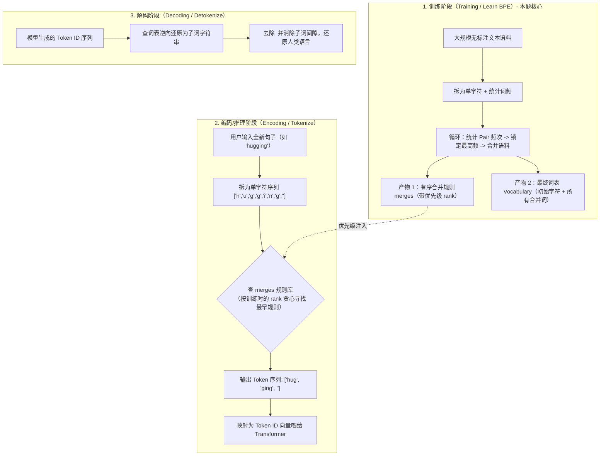

# BPE（Byte Pair Encoding，字节对编码）算法学习笔记与核心语法详解

> **学习背景**：  
> 本篇笔记基于大模型分词器（Tokenizer）经典算法题 **《BPE Tokenizer（字节对编码）》** 的手撕推导过程整理。  
> 区别于前面简单的组件搭积木，BPE 是一道标准的 **NLP 文本处理算法题**。本篇记录 BPE 的历史诞生背景、前两个核心步骤的代码推导，以及在编写过程中沉淀的高频 Python 底层语法。

---

## 一、 为什么大模型（LLM）必须使用 BPE？（诞生背景）

在 2015 年以前，传统的自然语言处理（NLP）在将文本喂给模型前，面临着一个**“非此即彼”的两难困境**：

### 1. 方案一：按“整词”分词（Word-level Tokenization）
* **做法**：以空格或标点切分，把 `"unhappiness"` 作为一个独立的 Token。
* **致命痛点 1（词表爆炸）**：英语常用词数十万，形态变化丰富，词表动辄上百万，模型 Embedding 矩阵显存直接吃不消。
* **致命痛点 2（OOV 未登录词，Out-Of-Vocabulary）**：只要遇到未见过的生僻词、新造词（如 `"ChatGPT-ish"`）或拼写错误，模型只能用 `<UNK>`（Unknown）代替。一段文字如果包含几个 `<UNK>`，整句话的语义就彻底丧失了。

### 2. 方案二：按“单字符”分词（Character-level Tokenization）
* **做法**：拆碎成 26 个英文字母和标点符号，如 `'u', 'n', 'h', 'a', 'p', 'p', 'i', 'n', 'e', 's', 's'`。
* **致命痛点 1（序列急剧变长）**：原本 10 个词的句子变成 100 个字符。Transformer 注意力机制的计算复杂度是 $O(S^2)$，序列变长 10 倍，算力直接爆炸 100 倍！
* **致命痛点 2（单字缺乏独立语义）**：单独一个字母 `'h'` 没有独立表意能力。

---

### 3. BPE 的破局：子词分词（Subword Tokenization）
1994 年，Philip Gage 发明了 BPE 原本用于**数据压缩**。2015 年，Sennrich 等人将其借用到 NLP 中，成为了当今大模型的通用标准（**GPT-2/3/4、LLaMA、RoBERTa、Mistral 均基于此**）：

* **核心直觉**：
  * **高频词不拆开**：如 `"the"`、`"dog"` 出现成千上万次，保持为一个整体；
  * **低频罕见词拆成有意义的子词（Subwords）**：如 `"unhappiness"` $\to$ `"un"` + `"happi"` + `"ness"`；
  * **彻底消灭 OOV**：即使遇到完全没见过的全新词汇，最坏情况也能退化为单个字符进行拼装，**永远不会报错 `<UNK>`**！

---

## 二、 算法目标与函数输入输出规范

### 1. 题目目标
在训练语料库中，通过循环迭代 `num_merges` 次：
1. 找出当前语料中**出现频次最高的相邻两个 Token（Best Pair）**；
2. 将它们**合并（Merge）**成一个全新的 Token；
3. 将该合并操作记录在案；
4. 更新语料库，进入下一轮统计与合并。

### 2. 函数签名（Function Signature）与类型规范

```python
def bpe(corpus: dict[str, int], num_merges: int) -> list[tuple[str, str]]:
```

* **输入参数 1：`corpus: dict[str, int]`**
  * 语料库字典。
  * **Key（`str`）**：以空格分隔的当前单词切分序列，末尾带特殊词尾符 `</w>`（如 `"h u g </w>"`）。
  * **Value（`int`）**：该词在语料中出现的**词频**（如 `10`）。
* **输入参数 2：`num_merges: int`**
  * 最大允许执行的合并次数（如 `2`）。
* **返回值（输出）：`list[tuple[str, str]]`**
  * ⚠️ **注意：返回值不是字典，而是按时间顺序记录每次合并的元组列表**！
  * 示例输出：`[('u', 'g'), ('ug', '</w>')]`。

---

## 三、 第一步剖析：相邻 Pair 的词频加权统计

### 1. 核心代码
```python
pairs = defaultdict(int)
for word, freq in corpus.items():
    symbols = word.split()
    for i in range(len(symbols) - 1):
        pairs[(symbols[i], symbols[i + 1])] += freq
```

### 2. 语法点 1：`defaultdict(int)` —— 优雅消灭 KeyError
* **所属模块**：`from collections import defaultdict`
* **原理**：普通字典 `d[key] += 1` 若 `key` 不存在会触发 `KeyError`。
* **机制**：向 `defaultdict` 传入工厂函数 `int`（无参调用 `int()` 返回 `0`）。当访问不存在的键时，**自动初始化为 `0`**，直接进行 `+= freq`，安全省事。

### 3. 语法点 2：`corpus.items()` —— 字典的双变量解包
* **字典的三种取法**：
  * `d.keys()`：仅遍历键（Key）；
  * `d.values()`：仅遍历值（Value）；
  * `d.items()`：同时返回 `(键, 值)` 构成的元组视图。
* **写法**：`for word, freq in corpus.items():` 利用 Python 的**元组解包（Unpacking）**，单行同时拿到单词字符串和对应的词频整数。

### 4. 语法点 3：`word.split()` 函数原型与参数
* **函数原型**：`str.split(sep=None, maxsplit=-1) -> list[str]`
* **参数行为**：
  * `sep=None`（默认）：按照空白字符（空格、`\t`、`\n`）切分，**自动吃掉连续冗余空格**，不留空白碎项。
  * `maxsplit=-1`（默认）：全部分割到底。
* **效果**：`"h u g </w>".split()` $\to$ `['h', 'u', 'g', '</w>']`。

### 5. 语法点 4：为什么是 `range(len(symbols) - 1)`？（减 1 的原因）
* **滑动窗口原理**：$N$ 个排成一排的元素，**相邻两两配对只能配出 $N - 1$ 对**（植树问题/篱笆原理）。
* **防越界防御**：若不减 1，当 `i` 取到最后一个索引时，访问 `symbols[i + 1]` 会直接触发 `IndexError: list index out of range`（下标越界）。

### 6. 语法点 5：为什么是 `+= freq`（加权累加）？
* 单词 `"h u g </w>"` 出现了 10 次，说明它内部包含的每一个相邻配对（如 `('u', 'g')`）也随之出现了 10 次。
* 跨单词加权累加后，`pairs[('u', 'g')]` 就能准确汇总该字符对在全篇文本中的总出现频次。

### 7. 语法总结：Python 中圆括号 `()` 的全景形态
在本步中，`pair = (symbols[i], symbols[i + 1])` 的右侧使用了圆括号，其全面语法归类如下：

| 语法场景 | 代码示例 | 说明 |
| :--- | :--- | :--- |
| **元组构造（本代码）** | `(a, b)` | 不可变序列，**可以作为字典的 Key**（列表则不行） |
| **单元素元组陷阱** | `(a,)` | **必须带逗号**，否则 `(a)` 只是普通的数学运算括号 |
| **生成器表达式** | `(x for x in data)` | 惰性计算，随用随算，极度节省内存 |
| **改变运算优先级** | `(a + b) * c` | 改变运算顺序 |
| **函数与类调用** | `len(x)` / `Class()` | 执行可调用对象 |
| **优雅多行折行** | `with (open() as f1, ...):` | PEP 8 推荐折行方式，避免反斜杠 `\` |

---

## 四、 第二步剖析：锁定最高频 Pair（`max` 与 `get` 的精妙配合）

### 1. 核心代码
```python
if not pairs:
    break
best_pair = max(pairs, key=pairs.get)
merges.append(best_pair)
```

### 2. 语法点 1：`max()` 函数原型与参数
* **函数原型**：`max(iterable, *, key=None, default=None) -> Any`
* **参数剖析**：
  * `iterable`：传入字典 `pairs` 时，**Python 默认只拿字典的所有的“键”（即待比选的 token 对元组）进行遍历比大小**。
  * `key`：**裁判评分函数（Callable）**。告诉 `max` 不要按候选人自身（字母拼音顺序）比，而是按 `key(候选人)` 算出来的数值比大小。
* **返回值**：返回使 `key` 函数计算结果最大的**那个原始候选键（Key）**，即最高频的元组 `('u', 'g')`。

### 3. 语法点 2：`dict.get()` 函数原型与安全机制
* **函数原型**：`dict.get(key, default=None) -> Any`
* **对比直接索引 `dict[key]`**：
  * `d[key]`：若 key 不存在，**直接崩溃报 `KeyError`**；
  * `d.get(key, default)`：若 key 不存在，**优雅返回 `default`（默认 None）**，绝不崩溃。

### 4. 语法点 3：为什么传 `key=pairs.get` 而不加括号？
* `pairs.get(...)`（带括号）：是执行函数并获取结果；
* `pairs.get`（不带括号）：是**传递函数对象本身作为回调裁判**。
* `max` 内部在打擂台时，会自动拿每一个候选 key 喂给 `pairs.get(key)` 查出词频数值，最后把词频最高的那对元组选出来。

---

## 五、 第三步剖析：全语料替换合并（双指针跳步与语料库重构）

### 1. 核心代码
```python
new_corpus = {}
first, second = best_pair
for word, freq in corpus.items():
    symbols = word.split()
    new_symbols = []
    i = 0
    while i < len(symbols):
        if i < len(symbols) - 1 and symbols[i] == first and symbols[i + 1] == second:
            new_symbols.append(first + second)
            i += 2  # 成功命中目标对，指针向前跳跃 2 步（跳过 first 和 second）
        else:
            new_symbols.append(symbols[i])
            i += 1  # 未匹配，原样保留当前 token，指针仅前进一步
    new_corpus[' '.join(new_symbols)] = freq
corpus = new_corpus
```

### 2. 语法点 1：元组解包 `first, second = best_pair`
* `best_pair` 是一个二元元组，例如 `('u', 'g')`。
* 利用 Python 的**序列解包（Tuple Unpacking）**，单行将其拆解为两个独立的字符串变量：`first = 'u'`，`second = 'g'`，代码可读性极高。

### 3. 语法点 2：为什么必须用 `while` 循环？（不能用 `for` 的根本原因）
* **`for i in range(...)` 的缺陷**：
  Python 中的 `for` 循环是基于迭代器驱动的。如果写成 `for i in range(len(symbols)):`，即使在循环体内部执行 `i += 1` 或 `i += 2`，在下一轮循环开始时，`i` 依然会被 `range` 迭代器强制重置为下一个默认顺序值！因此，**`for` 循环无法实现动态跳跃步长**。
* **`while` 循环的双指针跳步控制**：
  * **命中合并（Hit）**：当连续两个 token 正好是 `first` 和 `second` 时，二者被熔接为一个新 token（`first + second`），此时必须**同时跳过这两个已消耗的 token**，即 `i += 2`。
  * **未命中（Miss）**：当前 token 保持不变原样加入，指针继续探测下一个位置，即 `i += 1`。

### 4. 语法点 3：`if i < len(symbols) - 1` 的边界与短路保护
* **防越界防御**：与第一步类似，要检查 `symbols[i + 1]`，前提必须是 `i + 1` 不越界，即 `i < len(symbols) - 1`。
* **短路求值（Short-circuit Evaluation）**：
  在 Python 的 `and` 逻辑链中：
  ```python
  if i < len(symbols) - 1 and symbols[i] == first and symbols[i + 1] == second:
  ```
  如果 `i` 已经处于最后一个元素（`i < len(symbols) - 1` 为 `False`），Python 会**立即短路终止判断**，根本不会去执行后面的 `symbols[i + 1]`，从而绝对安全地避免了 `IndexError`。

### 5. 语法点 4：`new_corpus[' '.join(new_symbols)] = freq` 深度剖析
* **函数原型**：`str.join(iterable: Iterable[str]) -> str`
  * **调用者（Caller）**：`' '`（以空格字符串作为分隔胶水）；
  * **入参（Parameter）**：`new_symbols`（子词列表，如 `['h', 'ug', '</w>']`）；
  * **返回值（Return）**：拼接后的完整新词字符串（如 `"h ug </w>"`）。
* **形象比喻：剪刀与胶水**：
  1. `symbols = word.split()`：用**剪刀**沿空格剪开，拆碎成单个零件列表进行加工；
  2. `while` 内部处理：替换融合零件；
  3. `' '.join(new_symbols)`：用**带空格的胶水**重新把零件串联起来。
* **为什么胶水必须是 `' '` 而绝不能是 `''`？**
  如果写成 `''.join(...)`，拼接出的结果会变成 `"hug</w>"`。当进入下一轮循环时，`word.split()` 默认按空格切分，切出来的列表将只有一个元素 `['hug</w>']`，导致根本无法再两两配对，整个算法在第二轮就会直接报废！

### 6. 单词内部替换跟踪表（以 `"p u g s </w>"` 替换 `('u', 'g')` 为例）

初始状态：`symbols = ['p', 'u', 'g', 's', '</w>']`，目标对：`first='u', second='g'`

| 步数 | 当前指针 `i` | 当前检查项 | 是否匹配 `('u', 'g')` | 动作 | `new_symbols` 累积内容 | 下一步 `i` |
| :---: | :---: | :---: | :---: | :---: | :---: | :---: |
| 1 | `0` | `symbols[0]='p'` | 否 | `append('p')`，`i += 1` | `['p']` | `1` |
| 2 | `1` | `('u', 'g')` | **是** | `append('ug')`，`i += 2` | `['p', 'ug']` | `3`（跳过 'g'） |
| 3 | `3` | `symbols[3]='s'` | 否 | `append('s')`，`i += 1` | `['p', 'ug', 's']` | `4` |
| 4 | `4` | `symbols[4]='</w>'` | 越界保护（已到末尾） | `append('</w>')`，`i += 1` | `['p', 'ug', 's', '</w>']` | `5` |
| 5 | `5` | 循环终止条件 | `i >= len(symbols)` 退出 `while` | `' '.join(...)` 粘合写回 | `"p ug s </w>"` | 结束 |

---

## 六、 实战避坑警示录（编写过程中踩过的 2 大经典 Bug）

手撕算法时，细微的变量名与拼接符差错都会引发隐蔽的系统级故障。以下是本题实战中真实经历的两个高价值避坑点：

### 1. 经典 Bug 1：单复数笔误 —— `max(pair, key=pairs.get)`
* **错误写法**：
  ```python
  best_pair = max(pair, key=pairs.get)  # 误写成了单数的 pair
  ```
* **引发异常**：
  ```text
  TypeError: '>' not supported between instances of 'NoneType' and 'NoneType'
  ```
* **底层根因**：
  1. `pair` 是第一步统计内层循环遗留下来的一个二元元组，例如 `('s', '</w>')`。
  2. 把元组传给 `max`，`max` 会把元组作为 `iterable` 遍历它的每个单字：`'s'` 和 `'</w>'`。
  3. `max` 拿单字去调用 `pairs.get('s')`，但在字典 `pairs` 中，**所有的 Key 都是二元元组，根本不存在字符串类型的 Key**！
  4. 于是 `pairs.get('s')` 返回 `None`，`pairs.get('</w>')` 也返回 `None`。
  5. `max` 尝试比对两个候选者的分数 `None > None`，Python 瞬间抛出 `TypeError` 崩溃。
* **规避法则**：比选打擂台时，传给 `max` 的必须是包含全量候选键的**复数字典 `pairs`**，即 `max(pairs, key=pairs.get)`。

### 2. 经典 Bug 2：胶水用错 —— `new_corpus[''.join(new_symbols)] = freq`
* **错误写法**：
  ```python
  new_corpus[''.join(new_symbols)] = freq  # 遗漏了空格，成了空字符串
  ```
* **引发后果**：
  * 程序运行不报错，但第 1 轮结束后输出提前截止，测试用例预期 2 次合并却只合并了 1 次，返回 `[('u', 'g')]`。
* **底层根因**：
  1. 第 1 轮合并后，原语料 `"h u g </w>"` 被无缝连接成了 `"hug</w>"`（中间缺失了空格）；
  2. 第 2 轮开始执行 `symbols = word.split()` 时，由于字符串中没有空格，切分结果变成了单元素列表 `['hug</w>']`；
  3. `len(symbols) - 1` 计算为 `0`，`for i in range(0)` 直接跳过，导致 `pairs` 字典没有任何数据被加入；
  4. 触发 `if not pairs: break` 判定，提前退出外层循环。
* **规避法则**：牢记 BPE 语料库的**格式契约（Contract）**——“子词之间必须以空格隔开”。切碎与还原必须成对匹配：`split()` 切开，就必须用 `' '.join()` 拼回。

---

## 七、 BPE 的全生命周期：训练 vs 编码/推理 vs 词表生成

初学者常常混淆：**“我们手撕的这道题到底算 BPE 的哪一部分？它和模型推理时的分词是一回事吗？”**  
答案是：**我们手撕的是 BPE 最核心的【训练阶段（Training / Learning）】**。BPE 在工业落地中拥有完整的三阶段生命周期：



### 1. 阶段一：训练阶段（Training / Vocabulary Construction）
* **任务**：利用大规模静态文本库，从零“学习”出最划算的合并策略。
* **核心动作**：即本题所实现的算法——加权统计、贪心选极值、全量语料重构。
* **两大产物**：
  1. **合并规则列表（`merges`）**：形如 `[('u', 'g'), ('ug', '</w>'), ...]`。规则在列表中的先后索引下标，即为该规则的**绝对优先级（Rank）**。
  2. **最终词表（Vocabulary）**：
     $$\text{词表} = \text{基础字母/标点字符集} \cup \text{所有合并产生的新子词}$$
     （对应经典算法题：`3922. BPE 生成词表`）。

### 2. 阶段二：编码/分词阶段（Encoding / Inference）
* **任务**：在模型推理或训练输入前，把任意一个从未见过的新句子切分成子词。
* **关键差异**：**此时不能再统计词频！因为单句根本没有全局词频可言**。
* **推理逻辑**：
  1. 将输入词拆成单个字符序列；
  2. 遍历该序列中所有当前相邻的 Pair；
  3. 去训练好的 `merges` 规则库中查询这些 Pair 的 Rank，**找出当前优先级最高（最先被学到）的那对 Pair 优先合并**；
  4. 循环此过程，直到当前序列中的任何相邻 Pair 都不在规则库中为止。

### 3. 阶段三：解码阶段（Decoding / Detokenization）
* **任务**：大模型生成出数字列表（Token IDs）后，将其还原为自然语言文本。
* **逻辑**：将 ID 映射为字符串碎片，去掉特殊结尾符（如 `</w>` 或 GPT 的 `Ġ`），拼接成完整文本。

---

## 八、 最终完整源码与严格测试用例

```python
"""
字节对编码（Byte Pair Encoding, BPE）分词器 - 训练阶段实现
"""
from collections import defaultdict


def bpe(corpus: dict[str, int], num_merges: int) -> list[tuple[str, str]]:
    """
    执行 BPE 算法的训练阶段，学习指定轮数的最佳合并规则。

    Args:
        corpus: 语料库字典，Key 为以空格分隔的当前 Token 序列，Value 为出现词频
        num_merges: 允许的最大合并轮数

    Returns:
        merges: 记录每一次合并操作的有序元组列表，格式为 [(token1, token2), ...]
    """
    merges: list[tuple[str, str]] = []

    for _ in range(num_merges):
        # 1. 加权统计当前语料库中所有相邻 Token 对的频次
        pairs = defaultdict(int)
        for word, freq in corpus.items():
            symbols = word.split()
            for i in range(len(symbols) - 1):
                pair = (symbols[i], symbols[i + 1])
                pairs[pair] += freq

        # 保护边界：若语料库已被完全合并（无法再形成配对），提前终止
        if not pairs:
            break

        # 2. 找出当前频次最高的 Token 对（打擂台）
        best_pair = max(pairs, key=pairs.get)
        merges.append(best_pair)

        # 3. 在语料库中全局替换并合并该 Token 对
        new_corpus = {}
        first, second = best_pair
        for word, freq in corpus.items():
            symbols = word.split()
            new_symbols = []
            i = 0
            while i < len(symbols):
                # 命中目标对，指针跃迁 2 步
                if i < len(symbols) - 1 and symbols[i] == first and symbols[i + 1] == second:
                    new_symbols.append(first + second)
                    i += 2
                else:
                    new_symbols.append(symbols[i])
                    i += 1
            # 维持空格胶水契约，重构语料库
            new_corpus[' '.join(new_symbols)] = freq
        corpus = new_corpus

    return merges


if __name__ == '__main__':
    print("=" * 60)
    print("测试用例 1: 题目官方示例")
    corpus = {"h u g </w>": 10, "p u g </w>": 5, "p u g s </w>": 5}
    num_merges = 2
    res = bpe(corpus, num_merges)
    print(f"合并规则输出: {res}")
    expected = [('u', 'g'), ('ug', '</w>')]
    assert res == expected, f"用例 1 失败！预期 {expected}，实际 {res}"
    print(">>> 判定: 通过！<<<")
    print("=" * 60)
```

---

## 九、 考研复试 / 算法面试高频考察要点（提问精粹）

### Q1：BPE 算法的时间复杂度是多少？有哪些工程优化手段？
* **基础版本复杂度**：设语料库总词数为 $V$，单词平均长度为 $L$，合并轮数为 $K$。每轮都需要全量遍历语料做加权统计与字符串重构，单轮复杂度为 $O(V \cdot L)$，总体复杂度为 $O(K \cdot V \cdot L)$。
* **工程优化（如 HuggingFace Tokenizers 底层 Rust 实现）**：
  1. **倒排索引（Inverted Index）**：记录每个 Pair 出现在哪些单词中。合并 `('u', 'g')` 时，无需扫描不相关的单词，只需定向更新包含该 Pair 的词条；
  2. **最大堆 / 优先队列（Max Heap）**：维护 Pair 词频，避免每轮线性调用 `max()` 全量打擂台。

### Q2：GPT 系列所用的 Byte-level BPE（BBPE）与经典 BPE 有什么区别？
* **经典 BPE 的局限**：初始字符表基于 Unicode 字符（Characters）。世界上有数万个汉字、emoji 和特殊符号，导致初始基础字符表依然庞大，且遇到非常罕见的 Unicode 符号仍可能出现未知字符。
* **Byte-level BPE（GPT-2 / LLaMA / Qwen）的破局点**：
  * **一切皆字节（Byte）**：计算机底层所有文本本质上都是 utf-8 编码的字节序列（取值范围只有固定的 $0 \sim 255$）。
  * 初始词表大小固定为**绝对不变量 256**！
  * **收益**：从 256 个基础字节出发开始合并，**无论世界上任何语言、任何罕见字符还是 emoji，都能 100% 毫无死角地被分解和重构，从数学底层彻底杜绝了 OOV 问题**！

