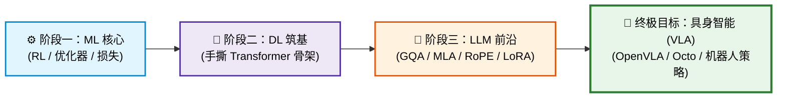

# 🤖 具身智能 (VLA) 前置算法通关指南：ML / DL / LLM 核心考点手册

> [!TIP]
> **🎯 核心刷题心法**  
> 凡是与 **“多模态 / Transformer 架构 / 动作控制 / 强化学习 / 部署加速”** 相关的，全部死磕；  
> 凡是与 **“古典统计学 / 传统分类器 / 纯文本 NLP 浅层对齐”** 相关的，快速略过，拒绝无效内耗！

---

## 🗺️ 通关全景技术路线图

---

## 模块一：机器学习（76题）——“抓大放小，主攻 RL 与底层优化”

机器学习题单中有很多古典统计学习方法，具身智能（Robotics & Embodied AI）更偏向于**深度强化学习、动作位姿回归与优化器底层**。

### 🔴 S 级：必须手推与深入理解（优先攻克 · 核心基石）
- [ ] **强化学习（RL）基础**（具身底盘移动与机械臂步态控制核心）：
  - **Q-Learning** 与 **贝尔曼方程（Bellman Equation）** 的状态转移推导。
  - **$\epsilon$-Greedy 策略**：探索（Exploration）与利用（Exploitation）的权衡。
- [ ] **梯度下降与反向传播基石**：
  - 批量梯度下降 (BGD)、随机梯度下降 (SGD)、小批量 (Mini-batch SGD) 的收敛速度与震荡对比。
- [ ] **连续控制评估与损失函数**：
  - **RMSE / MAE**：末端位姿回归（End-effector Pose Regression）基本指标。
  - **混淆矩阵 / F1 分数 / Accuracy / PR-AUC**：通用评测八股。

### 🟡 A 级：搞懂原理与选型机制（知其然知其所以然）
- [ ] **过拟合与正则化**：
  - **L1 (Lasso) vs L2 (Ridge)**：为什么 L1 能带来稀疏解？（画图法与先验分布：拉普拉斯先验 vs 高斯先验）。
- [ ] **降维与点云基础**：
  - **主成分分析（PCA）**：特征正交投影与最大方差理论（了解 3D 点云主轴提取与降维思想）。
- [ ] **传统分类/集成模型**：
  - **Logistic Regression & Softmax 回归**（深度学习分类头的数学雏形）。
  - **SVM（支持向量机）**：理解最大间隔超平面与核函数思想（**不建议死磕对偶拉格朗日乘子法**）。
  - **集成学习**：Bagging（降低方差）与 Boosting（降低偏差）的本质权衡。

> [!NOTE]
> **⚪ C 级（古典产物 · 10秒看答案直接跳过）**  
> `朴素贝叶斯` · `KNN / k近邻` · `K-Means 聚类` · `PAC 学习理论` · `概率图模型` · `规则学习` · `基尼不纯度手动推导` · `多项式特征`

---

## 模块二：深度学习（114题）——“筑基：吃透 Transformer 骨架”

这是从 ML 跨向大模型的最关键跳板，必须彻底搞懂**张量维度变化与底层手撕**。

### 🔴 S 级：白板手撕 / 代码必须一行行写出
- [ ] **缩放点积与多头注意力（MHA）**：
  - 必须用 PyTorch 纯 Tensor 手写：$Q, K, V$ 投影 $\to$ 除以 $\sqrt{d_k}$ $\to$ Softmax $\to$ 点乘 $V$ 的完整逻辑。
- [ ] **解码器栈与因果掩码（Causal Mask）**：
  - 手写下三角因果 Mask 矩阵（`torch.tril`），彻底理解自回归生成时为什么必须遮蔽未来信息。
- [ ] **现代 Norm 机制对比（高频面试必考）**：
  - **LayerNorm**：手写维度统计（沿着最后一维/特征维求均值和方差）。
  - **Pre-Norm vs Post-Norm**：搞懂原始 Post-Norm 难以训练深层的梯度流原因，以及为什么现代大模型全换成了 Pre-Norm（残差连接梯度直通）。
- [ ] **现代优化器与鲁棒控制损失**：
  - **AdamW**：权重衰减（Weight Decay）到底和 L2 正则化在实现上有什么区别？
  - **Huber 损失（Smooth L1）**：机械臂轨迹、连续控制量回归最抗异常值的 Loss。

### 🟡 A 级：概念八股与选型机制
- [ ] **“四大归一化”维度大满贯**：
  - 面对张量 $(B, C, H, W)$，清晰画出 **BN、LN、IN、GN** 分别是在哪些维度上求均值和方差，并解释为什么 CV 以前爱用 BN，而视觉/文本 Transformer 统一用 LN。
- [ ] **现代激活函数演进**：
  - **ReLU vs GELU vs Swish (SiLU)**：Dying ReLU 死区现象、平滑可导性、为什么现代 LLM 与 Diffusion 放弃了 ReLU。
- [ ] **残差连接（Residual Connection）**：
  - 梯度流反向传播数学推导：恒等映射如何消除梯度消失与深层网络退化。

> [!NOTE]
> **⚪ C 级（历史遗留 · 禁止内耗）**  
> `RNN / LSTM / GRU`（理解门控思想即可，不要死记三门公式） · `Adadelta / Adagrad / Adamax` · `LambdaLoss` · `SELU / PReLU / Softplus / Softsign`

---

## 模块三：LLM 题单——“紧跟现代前沿架构（DeepSeek / VLA 导向）”

直接命中主流大模型、多模态视觉大模型（VLM）及具身控制模型（VLA）的核心演进。

### 🔴 S 级：现代大模型核心基础设施（面试区分度最高）
- [ ] **注意力机制的现代演进（必考大满贯）**：
  - **MHA $\to$ MQA $\to$ GQA**：为了降低推理阶段 **KV Cache** 显存占用，Key/Value 是如何被分组共享的（LLaMA-3 / Qwen 核心）。
  - **MLA（Multi-head Latent Attention）**：**重点攻克**（DeepSeek-V2/V3/R1 核心），低秩联合压缩 KV 投影的数学原理。
  - **交叉注意力（Cross-Attention）**：**具身 VLA 的绝对命脉**（图像特征/人类语言指令如何通过 Cross-Attention 注入到机械臂 Action Token 中）。
  - **FlashAttention & PagedAttention**：
    - FlashAttention：利用 GPU SRAM 高速分块减少 HBM 读写 IO 的精妙计算重排；
    - PagedAttention：借鉴操作系统虚拟内存分页，彻底根治 vLLM 显存碎片。
- [ ] **现代位置编码**：
  - **RoPE（旋转位置编码）**：必考！复数旋转变换、通过绝对位置点积实现相对位置关系的数学推导；了解 **ALiBi** 的斜率偏置思想。
- [ ] **现代模块标准配件**：
  - **RMSNorm**：去掉均值偏移计算，前向/反向速度大幅提升。
  - **SwiGLU**：带有门控机制的 FFN（LLaMA/Qwen 全系标配）。
- [ ] **参数高效微调（PEFT）**：
  - **LoRA / QLoRA**：低秩分解 $W + \Delta W = W + B \times A$，参数量计算与显存节省原理，零开销权重合并机制。

### 🟡 A 级：强化学习对齐（RLHF）、采样与工程选型
- [ ] **大模型后训练与对齐路线**：
  - **GRPO（Group Relative Policy Optimization）**：**重中之重**！DeepSeek-R1 灵魂所在，彻底去掉 Critic 价值模型（节省海量显存），纯靠组内相对奖励直接优化 Policy。
  - **DPO vs PPO**：搞懂 DPO 为什么不需要单独训练奖励模型（Reward Model），直接通过显式偏好对优化损失；了解极致轻量级的 **SimPO**。
- [ ] **MoE（混合专家模型）架构**：
  - **Top-K 门控（Gating）**、**专家路由（Expert Routing）** 与 **负载均衡损失（Load Balancing Loss）** 的作用。
- [ ] **推理与解码策略**：
  - **Top-K 采样、Top-P (Nucleus) 采样、温度系数（Temperature）** 调节概率分布的逻辑。
  - **Left-Padding（左填充）**：为什么自回归生成式模型做 Batch 推理/训练时必须在左侧 Padding（防止因果掩码被右侧 Padding 污染位置信息）。

> [!NOTE]
> **⚪ C 级（略过或浅尝辄止）**  
> `束搜索 (Beam Search)`（生成式大模型开销过大，已边缘化） · `线性注意力 / 稀疏窗口注意力` · `ShortConv`  
> *(注：BPE / BBPE 分词算法已在 NLP 专题中手撕通关 ✅)*

---

## 模块四：通往 VLA（具身大模型）的通关规划表

| 学习阶段 | 重点攻克领域 | 建议精力占比 | 核心产出与检验标准 |
| :---: | :--- | :---: | :--- |
| **阶段 1：ML 扫盲** | 强化学习基础 (Q-learning)、梯度下降、RMSE/Huber Loss、L1/L2 | **15%** | 能白板推导 RL 状态转移与优化器更新公式 |
| **阶段 2：DL 筑基** | 手撕 MHA、Causal Mask、RMSNorm、AdamW、四种 Norm 对比 | **35%** | 用纯 PyTorch 零调包完整手撕出 Transformer Block |
| **阶段 3：LLM 前沿** | GQA/MLA、RoPE、SwiGLU、LoRA、FlashAttention、GRPO | **50%** | 吃透主流开源架构（Llama/Qwen/DeepSeek），能看懂 OpenVLA / Octo 源码 |